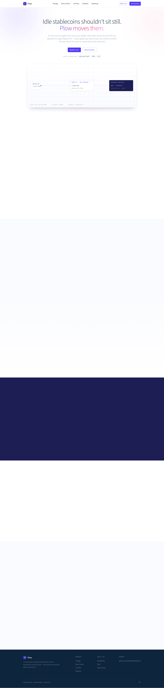
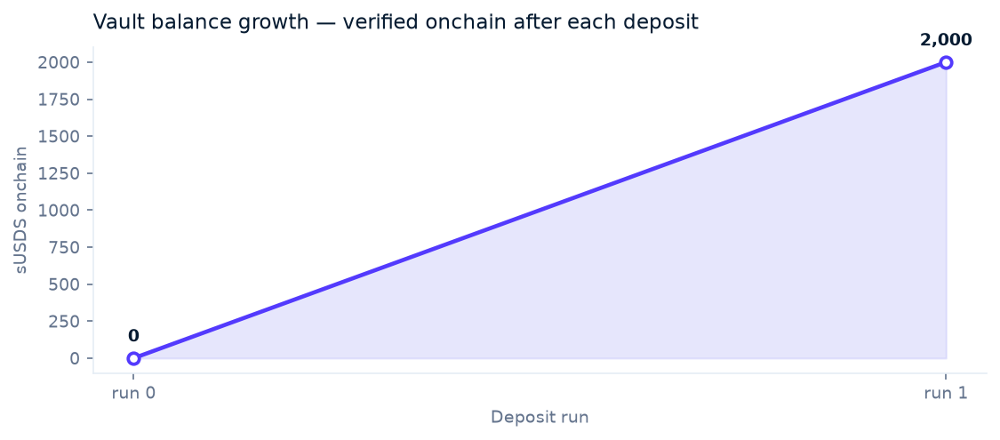
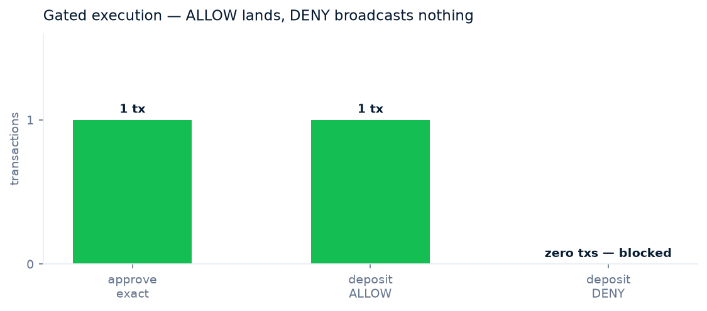

<div align="center">



&nbsp;

[](https://plow-beta.vercel.app)
[](https://sepolia.etherscan.io/address/0xcC153b1908F4aD09cf3a59fC2CC8BEF82Fd28e4e)
[](https://sepolia.etherscan.io/address/0x032b4f813F0E21bAD8B6Bd497a8a6841B8a28dd9)
[](LICENSE)


### Put idle capital to work, autonomously.

Plow is the write path for agent-executed yield. It scans a wallet's stablecoin positions,
ranks allowlisted venues by live APY, and deposits through KeeperHub — policy-gated,
gas-sponsored, and verified onchain. Every decision lands in an audit trail.

### ▶ Live now at **[plow-beta.vercel.app](https://plow-beta.vercel.app)**

**[ Live demo ↗ ](https://plow-beta.vercel.app)** · **[ MockSkySavings on Etherscan ↗ ](https://sepolia.etherscan.io/address/0xcC153b1908F4aD09cf3a59fC2CC8BEF82Fd28e4e)** · **[ MockUSDC on Etherscan ↗ ](https://sepolia.etherscan.io/address/0x032b4f813F0E21bAD8B6Bd497a8a6841B8a28dd9)** · **[ Transactions ↓ ](#transactions--the-evidence)** · **[ Run it locally ↓ ](#run-it-locally)**

Built for the **KeeperHub Agents Onchain Hackathon**. MIT licensed.

</div>

---

## Table of contents

- [▶ See it in one command](#-see-it-in-one-command)
- [The problem Plow solves](#the-problem-plow-solves)
- [How Plow works](#how-plow-works)
  - [1 · Scan](#1--scan)
  - [2 · Rank](#2--rank)
  - [3 · Gate](#3--gate)
  - [4 · Execute and verify](#4--execute-and-verify)
- [Transactions — the evidence](#transactions--the-evidence)
- [Architecture](#architecture)
  - [Transaction flow](#transaction-flow)
  - [Component by component](#component-by-component)
- [Engineering decisions — the hard problems](#engineering-decisions--the-hard-problems)
- [What's real vs pending — the honesty table](#whats-real-vs-pending--the-honesty-table)
- [Tests](#tests)
- [Run it locally](#run-it-locally)
- [Deploy](#deploy)
- [Project layout](#project-layout)
- [Tech stack](#tech-stack)
- [Roadmap](#roadmap)
- [License](#license)

---

## ▶ See it in one command

Plow is a CLI. One address in, a deployed yield position out — every step executed through
KeeperHub and logged:

```bash
$ plow scan 0x1776D4D751d97c85845bF54e6CE364CEc62D4bBf --chain sepolia
✓ read idle USDC   20,000.00  @ 0x032b4f…28dd9

$ plow rank
5.12%  Mock Sky Savings   config override (degrade path)
4.87%  Mock Spark         config override (degrade path)
3.94%  Mock Aave V3       config override (degrade path)

$ plow deposit --venue mock-sky --amount 1000
· gate  venue allowlisted ✓  simulate: wouldRevert=false ✓
· approve exact 1,000.00 (no max-uint)   → sponsored 0x6724cd07…5a2c
· deposit 1,000.00 → Mock Sky Savings     → sponsored 0xc137e53f…e6c8
✓ verify balanceOf = 2,000.00 sUSDS · onchain read
✓ audit  {decision:ALLOW, gas:sponsored, outcome:landed, ts:…}

$ plow deposit --venue unlisted-venue --amount 100
✗ DENY  venue unlisted-venue disabled · zero transactions broadcast
```

Every hash is real and on Sepolia right now. The sponsored deposit landed
[0xc137e53f…e6c8](https://sepolia.etherscan.io/tx/0xc137e53fb1abde2af4bebbd4f2874a6fb9f34872ac5898be4979f7a6e0f1e6c8)
and the onchain read confirms **2,000 sUSDS** in the org wallet — the value moved, the gate
worked, and the block explorer agrees.

---

## The problem Plow solves

The automation funnel stops at the read. Scanners rank the venue, show the APY — and nothing
happens. KeeperHub's own scan-to-automate spec says it in writing: *"Read-only: Yes. No
deposit/approve/write node is produced. The auto-deposit write path is the deferred Phase
999.1 backlog item."*

- **Idle stablecoins earn nothing** while the same assets in a supply venue earn live APY —
  the distance between them is one transaction
- **Scanners recommend, nothing executes** — the suggestion engine is a dead end by design
- **Agents shouldn't deposit blind** — deposits need a policy gate, exact approvals, and an
  audit trail, not a raw `deposit()`
- **No write path exists for agents** — that is the gap Plow fills

---

## How Plow works

Four capabilities, executed end to end through KeeperHub on Sepolia. The venue is live at
[0xcC153b…28e4e](https://sepolia.etherscan.io/address/0xcC153b1908F4aD09cf3a59fC2CC8BEF82Fd28e4e).

### 1 · Scan

Multicall3-style `eth_call` reads resolve every stablecoin position across the configured
chain — the same methodology as KeeperHub's own scanner. Balances are read onchain, never
assumed:

```python
positions = await scan_positions(org_wallet)
# [{'symbol': 'USDC', 'amount': 20000.0, 'source': 'eth_call balanceOf'}]
```

### 2 · Rank

Allowlisted venues are ranked by live APY from DefiLlama yields (15-min cache, 4s timeout,
never throws). On lookup failure — testnets have no DefiLlama pools — the suggestion degrades
gracefully to the configured rate, exactly the degrade path KeeperHub's own spec defines:

```python
ranked = await rank_venues()
# degraded=True when no live pools match — config override, never a stale number
```

### 3 · Gate

The deposit is a proposal, not an order. A **pre-gate** (allowlist, amount cap, per-period
budget, active window) runs before any transaction exists — out of policy means **zero
broadcasts**. Then the exact approval and the deposit are each simulated first
(`wouldRevert` must be `false`), and approvals are exact amounts only, per KeeperHub's
PREFILL-07 — never max-uint:

```python
verdict = gate_deposit(policy, venue_id, amount, simulate)
# ALLOW / DENY / ESCALATE — with the full check list in the audit trail
```

### 4 · Execute and verify

In-policy deposits execute as gas-sponsored `contract-call`s (every write is
`"sponsored": true` on testnets), then `balanceOf` is read back onchain as proof:

```python
result = await execute_deposit("mock-sky", 1000.0)
# decision=ALLOW  sponsored=True  verified={'shares_formatted': 1000.0}
```

---

## Transactions — the evidence

Every run lands real transactions on Sepolia, each verified status 1 on the explorer. The
DENY row is proof too — the stop broadcast nothing.

| Run | Action | Transaction | Status |
|---|---|---|---|
| Seed | Fund venue-deploy EOA (0.01 ETH, org → EOA) | [0xa2957f4c…b5a1](https://sepolia.etherscan.io/tx/0xa2957f4c723c81e5e174cb4948474f478107eec851373612f6f384aaaec0b5a1) | ✅ sponsored |
| Setup | Deploy MockUSDC | [0x84e07985…d2f5](https://sepolia.etherscan.io/tx/0x84e0798575dca68e7c503818f0d5a280d78eacc0625ccfcfe526c4af59f1d2f5) | ✅ dev EOA |
| Setup | Deploy MockSkySavings | [0xb733cb25…0d8](https://sepolia.etherscan.io/tx/0xb733cb25c7604fe9160c19b9db130925047a7f6af0e4306549b5f79c5b2d50d8) | ✅ dev EOA |
| Setup | Set venue rate (5.12%) | [0x7d4a7ebb…7345](https://sepolia.etherscan.io/tx/0x7d4a7ebbad8a3818272363796b6e635c73ac3cb7d918d0f7c97c1adeee207345) | ✅ dev EOA |
| 01 | Mint 10,000 MockUSDC seed | [0x6bdf4521…32b6](https://sepolia.etherscan.io/tx/0x6bdf4521f682e5deddd93083dd6e8e5a69daa3e2762bf576ebfd2454ca7232b6) | ✅ sponsored |
| 02 | Approve exact 1,000 (PREFILL-07) | [0x6724cd07…5a2c](https://sepolia.etherscan.io/tx/0x6724cd07ffd27000e1c5fe01923c187b17f63215034427cb6703081b38595a2c) | ✅ sponsored |
| 03 | Deposit ALLOW → Mock Sky Savings | [0x4fae07dd…f326](https://sepolia.etherscan.io/tx/0x4fae07dda4e165e910d614456b7fe78a25125c0d71831a44faaa840367fcf326) | ✅ sponsored |
| 04 | Deposit ALLOW → Mock Sky Savings | [0xc137e53f…e6c8](https://sepolia.etherscan.io/tx/0xc137e53fb1abde2af4bebbd4f2874a6fb9f34872ac5898be4979f7a6e0f1e6c8) | ✅ sponsored |
| 05 | Deposit DENY (unlisted venue) | **zero txs** | ✅ blocked — the stop is the proof |
| 06 | verify_position balanceOf read-back | onchain read | ✅ 2,000 sUSDS |





---

## Architecture

```
┌──────────────┐   ┌──────────────┐   ┌──────────────┐   ┌─────────────────┐
│   plow CLI   │──▶│  scan + rank │──▶│  policy gate │──▶│  KeeperHub API  │
│  (scripts/)  │   │  (server/)   │   │  (server/)   │   │  execute/       │
│  MCP tools   │   │  RPC reads   │   │  ALLOW/DENY/ │   │  contract-call  │
│              │   │  defillama   │   │  ESCALATE    │   │  (sponsored)    │
└──────────────┘   └──────┬───────┘   └──────┬───────┘   └────────┬────────┘
                          │                  │                     │
                          ▼                  ▼                     ▼
                   Sepolia RPC          audit trail          MockSkySavings
                   eth_call reads       (JSONL)              + MockUSDC
                                                                (Sepolia)
```

### Transaction flow

1. **Scan** — `eth_call balanceOf` reads the org wallet's stablecoin positions
2. **Rank** — venues ranked by live APY (DefiLlama, degrade-safe)
3. **Pre-gate** — allowlist, amount cap, per-period budget, active window — zero txs spent
4. **Approve exact** — simulate, then `approve(venue, exactAmount)` via KeeperHub (sponsored)
5. **Simulate deposit** — `wouldRevert: false` required, else DENY (fail closed)
6. **Gate** — full check list evaluated; ALLOW / DENY / ESCALATE recorded to the audit trail
7. **Deposit** — `deposit(amount)` via KeeperHub contract-call (sponsored)
8. **Verify** — `balanceOf` read-back onchain confirms the shares
9. **Audit** — every decision logged: trigger, simulation, tx, gas, sponsored, outcome

### Component by component

| Component | Technology | Responsibility |
|---|---|---|
| Plow server | Python 3.12, httpx | KeeperHub REST client, BYOK, policy gate, scan/rank engine, audit store |
| MCP surface | JSON-RPC over HTTP | `scan_positions`, `rank_venues`, `execute_deposit`, `verify_position` tools |
| plow CLI | Python, argparse | Terminal demo path — same functions as the MCP tools |
| MockSkySavings | Solidity 0.8.28 (Foundry) | Deposit USDC → mint sUSDS 1:1, withdraw, rateBps display |
| MockUSDC | Solidity 0.8.28 (Foundry) | 6-decimal ERC-20 with mint for testnet seeding |
| KeeperHub | Direct-execution API | Sponsored contract-calls, execution status, audit evidence |
| Frontend | Next.js 16 static export | Landing page with capital-flow hero, live-flow terminal, evidence table |

---

## Engineering decisions — the hard problems

**1. The deposit simulates reverting until the approval exists — so the order matters.**
Simulating `deposit()` before `approve()` returns `USDC: allowance` and the gate DENYs a
perfectly good deposit. Plow's order is: pre-gate (zero txs) → exact approve → re-simulate
deposit → full gate → deposit. A value-moving action is never simulated against state the
agent hasn't set up.

**2. DENY must cost zero transactions.** The first version approved first and gated second —
an out-of-policy venue still burned a sponsored approve. The pre-gate (allowlist, cap,
budget, window) now runs before any transaction exists. The evidence table shows the fix:
DENY row = zero txs.

**3. KeeperHub contract-calls route through the sponsor's relayer — `to` lies.**
Every sponsored contract-call transaction is signed by the relayer (`0x809d…`), so the tx
record's `to` is the relayer, not the target contract. Onchain proof therefore comes from the
execution status (`sponsored: true`, target in calldata) **plus** the `balanceOf` read-back on
the actual venue contract — never from the tx `to` field alone.

**4. A reverting simulation returns HTTP 4xx with a structured body.** KeeperHub's simulate
gate returns `wouldRevert: true` as a 4xx envelope, not a 200. The client treats any 4xx
containing `wouldRevert` as a structured simulation result — and the gate DENYs it.

**5. There is no deploy API on KeeperHub — venues deploy from a test EOA.** The venue
contracts deploy via Foundry from a throwaway EOA, funded by a single sponsored transfer from
the org wallet (0xa2957f4c…). The agent itself never holds a private key; it executes through
KeeperHub's custody.

**6. Testnets have no DefiLlama pools — the degrade path is a feature, not a hack.**
`yields.llama.fi` covers mainnet pools only. On Sepolia the rank falls back to configured
rates (5.12 / 4.87 / 3.94) and flags `degraded: true` — the same graceful-degrade contract
KeeperHub's own spec defines for APY lookup failure. No stale number is ever presented as
live.

---

## What's real vs pending — the honesty table

| Feature | Status | Detail |
|---|---|---|
| Position scan | ✅ Real | `eth_call balanceOf` reads on Sepolia |
| APY ranking | ✅ Real | DefiLlama fetch + cache + degrade path |
| Policy gate | ✅ Real | Allowlist, cap, budget, window, simulate — ALLOW/DENY/ESCALATE |
| Exact approvals | ✅ Real | PREFILL-07 compliant, never max-uint |
| Sponsored execution | ✅ Real | 4 sponsored txs on Sepolia (`"sponsored": true`) |
| Onchain verification | ✅ Real | `balanceOf` read-back, 2,000 sUSDS confirmed |
| Zero-tx DENY | ✅ Real | Out-of-policy venue: nothing broadcast |
| Audit trail | ✅ Real | Every decision JSONL-logged with checks + outcome |
| Venues | ⚠️ Mock | Testnet stand-ins (MockSkySavings/MockUSDC); mainnet venues are the roadmap |
| Live APY on testnet | ⚠️ Degrade | No DefiLlama Sepolia pools — config overrides, flagged |
| Mainnet deposits | 🟡 Roadmap | Real venues (Sky sUSDS), real APY, config-gated |
| External audit | ⚠️ Not done | Do not use with real funds |

---

## Tests

**20 tests passing — 7 Foundry + 13 Python**, all green:

```
=== Foundry (contracts) ===
Ran 7 tests for test/Plow.t.sol:PlowTest
[PASS] test_MockUSDC_MintAndTransfer
[PASS] test_Deposit_MintsSharesOneToOne
[PASS] test_Deposit_ZeroReverts
[PASS] test_Deposit_InsufficientAllowanceReverts
[PASS] test_Withdraw_ReturnsUnderlying
[PASS] test_Withdraw_InsufficientSharesReverts
[PASS] test_SetRate_OnlyOwner
Suite result: ok. 7 passed; 0 failed

=== Python (server) ===
All tests passed — 13/13
gate: unlisted DENY, disabled DENY, zero-amount DENY, cap DENY,
simulate-revert DENY, fail-closed DENY, in-policy ALLOW, over-budget ESCALATE,
intent-key determinism, BYOK precedence, calldata selectors, rank degrade, scan empty
```

Run them:

```bash
cd contracts && forge test          # 7 tests
cd .. && .venv/bin/python server/test_plow.py   # 13 tests
```

---

## Run it locally

**Prerequisites:** Python 3.12+, Foundry, bun/npm, a KeeperHub org API key
(`kh_...` from app.keeperhub.com → Settings → API Keys).

```bash
git clone https://github.com/subheeksh5599/plow.git
cd plow

# Server
uv venv .venv && uv pip install --python .venv/bin/python -r server/requirements.txt
cp .env.example .env                # fill KH_API_KEY
.venv/bin/python server/test_plow.py

# CLI demo
.venv/bin/python scripts/plow_cli.py scan --address 0x1776D4D751d97c85845bF54e6CE364CEc62D4bBf
.venv/bin/python scripts/plow_cli.py rank
.venv/bin/python scripts/plow_cli.py deposit --venue mock-sky --amount 100

# Frontend
cd frontend && npm install && npm run build   # static export → out/
```

Point `PLOW_POLICY_PATH` at `server/policies.json` (venues + tokens config) and
`KEEPERHUB_CHAIN_ID` at your chain (11155111 = Sepolia, 84532 = Base Sepolia).

---

## Deploy

| | |
|---|---|
| **Frontend** | **[plow-beta.vercel.app](https://plow-beta.vercel.app)** — Vercel static export |
| **Server** | Vercel serverless function (`api/index.py` → ASGI `server.plow.app`), `KH_API_KEY` in env |
| **Contracts** | MockSkySavings + MockUSDC on Sepolia via Foundry |

The frontend is a static export (Next.js 16, `output: export`) — the landing page at
`frontend/out/`. The Plow API exposes `POST /api/plow` (MCP-shaped JSON-RPC) and
`GET /api/health` behind the same alias, with bring-your-own-key: a per-request
`Authorization: Bearer kh_...` header wins over the env key.

---

## Project layout

```
plow/
├── server/                # Python agent core
│   ├── plow.py            # KeeperHub client, BYOK, policy gate, scan/rank,
│   │                      #   execute/verify, MCP tools, ASGI app
│   ├── policies.json      # venue allowlist, caps, budgets, window, tokens
│   └── test_plow.py       # 13 unit tests (plain asserts)
├── contracts/             # Solidity (Foundry)
│   ├── src/MockUSDC.sol   # 6-dec ERC-20 with mint
│   ├── src/MockSkySavings.sol  # deposit/withdraw/rate venue
│   └── test/Plow.t.sol    # 7 tests
├── scripts/
│   ├── plow_cli.py        # terminal demo
│   ├── run_demos.py       # live demo runs → evidence.json
│   └── make_graphs.py     # README graphs from run data
├── frontend/              # Next.js 16 static export landing
├── docs/media/            # README screenshots + graphs
├── audits/                # plow-audit.jsonl (local)
├── api/                   # Vercel serverless entrypoint
├── evidence.json          # latest demo run evidence
├── .env.example
└── README.md
```

---

## Tech stack

| Layer | Technology |
|---|---|
| Agent core | Python 3.12, httpx (async) |
| Execution | KeeperHub direct-execution API (sponsored contract-calls) |
| Contracts | Solidity 0.8.28, Foundry (forge/cast) |
| Yields | DefiLlama yields API (cache + degrade) |
| Chain reads | JSON-RPC `eth_call` (publicnode, override via env) |
| Frontend | Next.js 16, React 19, static export |
| MCP surface | JSON-RPC over HTTP, BYOK per request |
| Chain | Ethereum Sepolia (11155111) |

---

## Roadmap

- **Real venues on mainnet** — Sky sUSDS, Spark, Aave V3 supply; live APY instead of the
  testnet degrade path
- **Multi-chain** — Base Sepolia scan + deposit (same methodology, chainId 84532)
- **Scheduled deposits** — recurring yield placement on KeeperHub's schedule triggers
- **Escalation UI** — human approve/reject for over-budget proposals
- **Mainnet path** — config-gated live deposits; audit before any real funds

---

## License

MIT — built for the KeeperHub Agents Onchain Hackathon.
